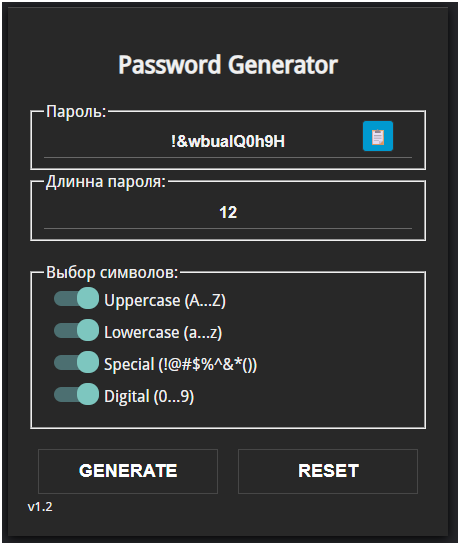

# JSPassGen 🔐🎲

Welcome to **JSPassGen**, the ultimate password generator that'll make your passwords stronger than a superhero's cape! 💪 This simple web app lets you create secure, random passwords with customizable options. No more "password123" – let's get creative! 😎

## Features 🚀

- **Customizable Length**: Set your password length from 1 to 128 characters. Who needs limits? 🌟
- **Character Sets**: Mix and match uppercase letters (A-Z), lowercase (a-z), special characters (!@#$%^&*()), and numbers (0-9). Pick your poison! 🧪
- **Real-time Generation**: Password updates instantly as you tweak options. Magic! ✨
- **Copy to Clipboard**: One-click copy with a fancy animation. Boom! 📋➡️
- **Reset Button**: Back to defaults in a flash. Fresh start! 🔄
- **Responsive Design**: Looks great on any device. Mobile-friendly! 📱

## How to Use 🤖

1. Open `index.html` in your favorite web browser. No server needed – it's pure static goodness! 🌐
2. Adjust the password length using the number input.
3. Check/uncheck the character set options (uppercase, lowercase, special, numbers).
4. Hit **GENERATE** to create your password. It appears in the text field automatically!
5. Click the copy button (📋) to copy the password to your clipboard. The icon changes to a checkmark (✓) for confirmation.
6. Use **RESET** to restore default settings and clear the password.

Pro tip: The password generates on-the-fly as you change options – no need to click generate every time! 🧠

## Technologies Used 🛠️

- **HTML5**: For the structure. Building blocks! 🧱
- **CSS3**: For the sleek, dark theme styling. Looking sharp! 🎨
- **JavaScript (Vanilla)**: For the logic and interactivity. No frameworks, just pure JS power! ⚡
- **Fonts**: Custom Droid Sans font for that retro feel. 📝

## Screenshots 📸


## Installation 🛠️

No installation required! Just clone the repo and open `index.html` in a browser.

```bash
git clone https://github.com/yourusername/JSPassGen.git
cd JSPassGen
# Open index.html in your browser